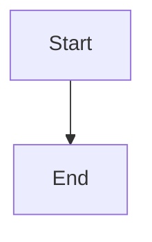

# WIP - not working so far

# MDP - Markdown Plus Editor

A feature-rich markdown editor written in vanilla JavaScript with support for advanced syntax, interactive previews, and multiple rendering libraries.

## Features

- **Core Markdown Support** - Full CommonMark compliance
- **Side-by-Side Preview** - Real-time markdown preview with toggle
- **Syntax Highlighting** - Code block highlighting with support for multiple languages
- **Mathematical Formulas** - Render LaTeX and math expressions
- **Chemical Formulas** - Display chemical structures and equations
- **SVG Support** - Embed and render scalable vector graphics
- **Mermaid Diagrams** - Auto-detect and render mermaid diagram syntax
- **Wiki Shortcuts** - Gollum wiki-style shortcuts for quick formatting
- **Interactive Elements** - Clickable checkboxes in preview mode
- **File Management** - Open and save markdown documents locally

## Architecture

```
mdp/
├── index.html              # Main entry point
├── css/
│   ├── style.css          # Main stylesheet
│   └── theme.css          # Theme variables and customization
├── js/
│   ├── main.js            # Application initialization
│   ├── editor.js          # Editor core functionality
│   ├── renderer.js        # Markdown rendering engine
│   ├── libs/              # External library handlers
│   │   ├── svg-handler.js
│   │   ├── math-handler.js
│   │   ├── chem-handler.js
│   │   ├── mermaid-handler.js
│   │   ├── syntax-highlighter.js
│   │   └── wiki-shortcuts.js
│   └── ui/                # UI components
│       ├── toolbar.js     # Top toolbar management
│       ├── sidebar.js     # Side panel management
│       └── preview.js     # Preview panel handler
└── README.md

```

## Getting Started

### Installation

1. Clone the repository:
   ```bash
   git clone https://github.com/msooon/mdp.git
   cd mdp
   ```

2. Open in browser:
   - Simply open `index.html` in your web browser
   - Or use a local server: `python -m http.server 8000`

### Usage

1. **Write Markdown** - Type in the editor panel on the left
2. **Toggle Preview** - Check the preview checkbox to see real-time rendering
3. **Use Toolbar** - Click buttons for syntax examples and quick formatting
4. **Save/Open** - Use the menu buttons to manage your documents

## Supported Syntax

### Basic Markdown
- Headers: `# H1`, `## H2`, etc.
- Bold/Italic: `**bold**`, `*italic*`
- Lists, blockquotes, code blocks

### Math
```
$$E = mc^2$$
```

### Chemistry
```
[H2O structure]
```

### Diagrams
```


### SVG
```
```svg
<svg width="100" height="100">...</svg>
```

## Design Principles

- **Modular Code** - Each feature in its own file for maintainability
- **Clean Implementation** - Short, readable, clear code
- **No Interference** - Libraries carefully isolated to prevent conflicts
- **User-Centric** - Intuitive UI with helpful syntax examples

## Libraries Used

- **Highlight.js** - Code syntax highlighting
- **KaTeX or MathJax** - Mathematical formula rendering
- **Mermaid** - Diagram rendering
- **Gollum Wiki** - Wiki shortcut syntax
- **Vanilla JS** - No framework dependencies (optional)

## License

MIT

## Contributing

Contributions welcome! Please ensure:
- Code is modular and maintainable
- New features don't interfere with existing libraries
- Tests are included for new functionality
